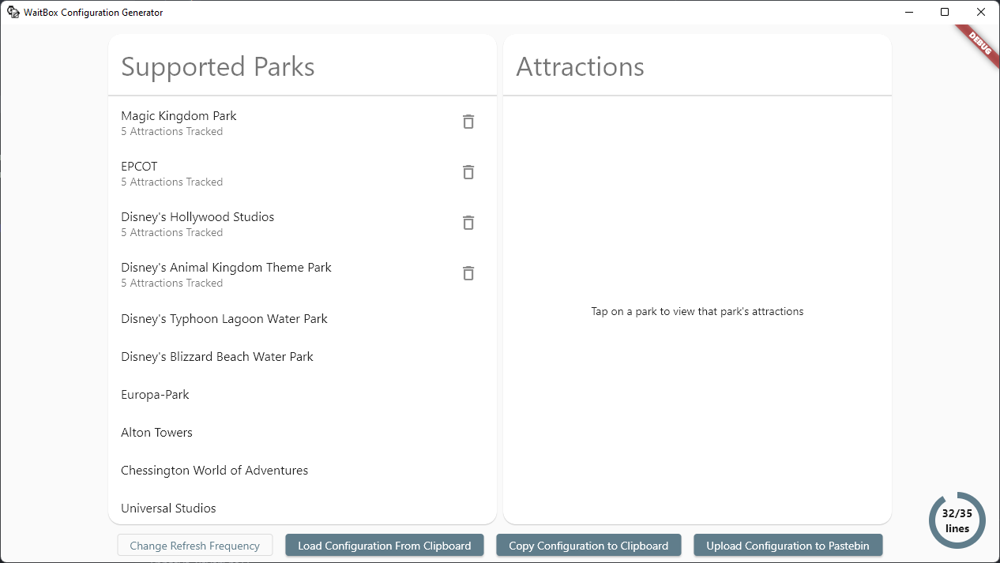
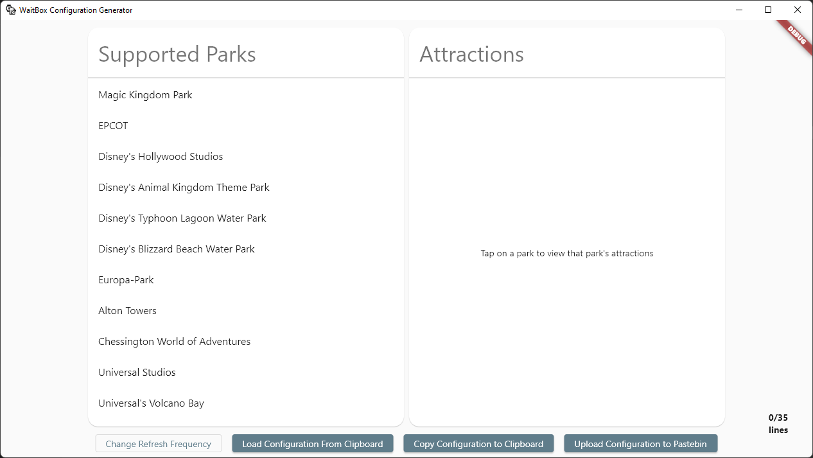

# WaitBox Configuration Generator

This is a desktop Flutter application designed for generating, editing, and
sharing configuration files for my WaitBox project.

It's been designed to run on Windows, but should (theoretically) run fine on
MacOS and Linux.

I would also build/release it for Web, but as it relies upon a third-party API,
and I don't have a proxy set up, CORS access policies prevent this from operating



## How to Use

Running the app presents you with a list of parks. Clicking on a park populates
the column to the right - that park's attractions. You can click on any attraction
to add that to the "tracking" list, to have it show up on the waitbox's display. 
You can click that attraction again to remove it. You can also click the "delete"
to the right of any park with tracked content to remove all attraction data for
that park.

In the bottom-right corner is a counter showcasing how many lines of the display
are used by the current configuration. This is an estimate, but it should give
a rought idea of how much space you have / have used.

You can adjust the refresh frequency of the screen by clicking the "Change Refresh Frequency" button in the bottom left corner of the screen. This will bring up a dialog, allowing you to select in a range from 5 minutes to an hour, in 5 minute increments.

When you're done, you can use either the "Copy" or "Upload" buttons to copy the
configuration file to your clipboard or uploaded to Pastebin, respectively.

If you want to edit an existing configuration file, just copy that into your
clipboard and click the "load" button.



## An example configuration document

This is a configuration document for a standard, four-park WDW watchlist. The
format of all configuration documents is the same - listing parks, attractions
as follows below.

```json
{
	"refreshFrequency": 5,
	"parks": [
		{
			"parkID": "75ea578a-adc8-4116-a54d-dccb60765ef9",
			"attractions": [
				"352feb94-e52e-45eb-9c92-e4b44c6b1a9d",
				"b2260923-9315-40fd-9c6b-44dd811dbe64",
				"796b0a25-c51e-456e-9bb8-50a324e301b3",
				"a5241f3b-4ab5-4902-b5ba-435132ef553d",
				"9d4d5229-7142-44b6-b4fb-528920969a2c"
			]
		},
		{
			"parkID": "47f90d2c-e191-4239-a466-5892ef59a88b",
			"attractions": [
				"480fde8f-fe58-4bfb-b3ab-052a39d4db7c",
				"8d7ccdb1-a22b-4e26-8dc8-65b1938ed5f0",
				"37ae57c5-feaf-4e47-8f27-4b385be200f0",
				"8f353879-d6ac-4211-9352-4029efb47c18",
				"81b15dfd-cf6a-466f-be59-3dd65d2a2807"
			]
		},
		{
			"parkID": "288747d1-8b4f-4a64-867e-ea7c9b27bad8",
			"attractions": [
				"1a2e70d9-50d5-4140-b69e-799e950f7d18",
				"6f6998e8-a629-412c-b964-2cb06af8e26b",
				"6e118e37-5002-408d-9d88-0b5d9cdb5d14",
				"34c4916b-989b-4ff1-a7e3-a6a846a3484f",
				"e516f303-e82d-4fd3-8fbf-8e6ab624cf89"
			]
		},
		{
			"parkID": "1c84a229-8862-4648-9c71-378ddd2c7693",
			"attractions": [
				"64a6915f-a835-4226-ba5c-8389fc4cade3",
				"24cf863c-b6ba-4826-a056-0b698989cbf7",
				"32e01181-9a5f-4936-8a77-0dace1de836c",
				"55c531b6-3ce2-4c47-a8a1-0dc9107d825b",
				"7a5af3b7-9bc1-4962-92d0-3ea9c9ce35f0"
			]
		}
	]
}
```